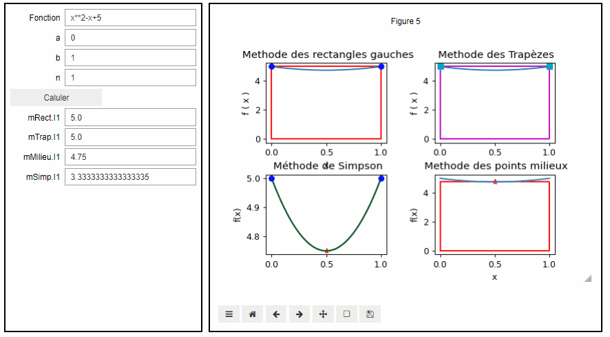

# TP_Analyse_Num_Python

 
 TP1:Methode de newton & Methode de dichotomie & Methode de point fixe
 
 TP2:Interpolation polynomiale
 
 TP3: Mini_Projet sur les methodes de l'integration numerique
 
 
